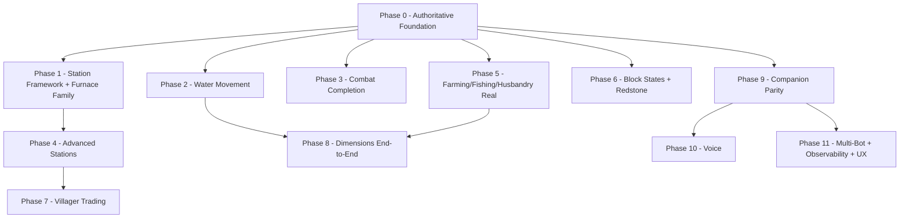

# Feature Gap Audit & Roadmap — DimsumMentAI → 1:1 Player Parity + MinePal

**Date:** 2026-09-29
**Status:** Audit complete, planning only — no implementation yet.
**Method:** Static code audit (grep + file reads) across all `internal/bot/*` packages,
`internal/ai`, `internal/config`, `cmd/`, `web/`, plus MinePal official sources
(minepal.net lobbies/updates/pal-voice/imagine/pocket pages, GitHub `0es/MinePal`
`src/agent/commands/actions.js`).

**Legend:** ✅ Implemented · 🟡 Partial/optimistic · ⚠️ Broken/misleading · ❌ Not found

---

## 1. Executive Summary

DimsumMentAI already has a strong foundation: LLM-driven autonomy (AGI goal loop,
planner, curriculum, watchdog), A* pathfinding with ladder/parkour/scaffold modes,
natural movement and gaze, template building, 2×2/3×3 crafting, authoritative chest
storage with sign reading, combat target selection with weapon tiering, dimension
detection, and a React web visualizer.

The dominant gaps fall into three categories:

1. **Optimistic success reporting** — many subsystems report success after writing a
   packet without waiting for server confirmation (`ExecuteAndWait` returns success
   for every non-craft action; fishing counts catches without a real fish; taming
   reports success unconditionally; furnace smelting never opens the container).
2. **Missing station/container workflows** — furnace family is broken, and brewing,
   enchanting, anvil, smithing, stonecutter, loom, cartography, grindstone, and
   villager trading do not exist as operational code.
3. **Missing player verbs** — swimming locomotion, vehicles (boat/minecart), mounts,
   elytra, bow/crossbow/trident firing, splash potions, buckets, redstone placement,
   block-state orientation, sign writing, and sneak-as-state are absent or stubs.

MinePal's differentiating features that are absent here: voice (TTS/STT/personality),
long-term cross-session memory with named places, AI-generated structures (Imagine),
home protection, awareness toggles, give-to-player, expedition packing, and multi-bot.

---

## 2. Current Feature Inventory (verified)

| Domain | Capability | Evidence |
|---|---|---|
| AI/LLM | Multi-provider chat (NVIDIA NIM, Minimax, OpenRouter), prompt builder, `<action>` parser, feedback loop | `internal/ai/prompts.go`, `parser.go`; `internal/bot/action/execute.go:260-579` |
| AGI brain | Goal loop, planner (async, step lifecycle), curriculum, episode briefs, escalation to LLM, watchdog (death/stuck/disconnect), natural idle, one-block reaction | `internal/bot/agi/` (28 files) |
| Movement | A* pathfinding (walk/drop/parkour/step-jump/diagonal/scaffold/ladder), hazard marking, stuck recovery, sprint flag, smooth gaze, head-tremor fix, idle gaze, arm-swing rhythm | `internal/bot/movement/`, `internal/bot/pathfinder/` |
| Building | Template-based placer, scanner, schematic JSON, coordinator | `internal/bot/building/` |
| Crafting | 2×2 + 3×3 table craft via ItemStackRequest, server recipe cache | `internal/bot/inventory_actions.go`, `internal/bot/inventory/crafting/table.go` |
| Storage | Chest/barrel/ender/hopper/shulker recognition, ContainerOpen-confirmed sessions, take/store via ItemStackRequest, sequential multi-chest search with sign reading | `internal/bot/storage/`, `container_session.go` |
| Gathering | Wood chopping, mining, looting, scaffolding | `internal/bot/gathering/` |
| Farming | Crop map (wheat/carrot/potato/beetroot/pumpkin/melon/sugar cane/cactus), harvest/plant/hoe | `internal/bot/farming/farmer.go` |
| Fishing | Find water + cast/reel (timer-based) | `internal/bot/fishing/fisher.go` |
| Husbandry | Breed (23 species), tame, milk/shear | `internal/bot/husbandry/` |
| Combat | Melee with LOS + cooldown, weapon tiering (sword/axe/bow/crossbow/trident/shield), shield raise/lower, PvP friendly-fire guard | `internal/bot/combat/` |
| Survival | Auto-eat, bed use, torch placement, emergency shelter, death recovery, potion use | `internal/bot/survival/` |
| Dimensions | Dimension detection from terrain, portal classification (lit/unlit/end-frame/end-open), stronghold hints | `internal/bot/dimension/dimension.go` |
| Safety | Ground-safety, breath-safety + surfacing reflex, corner-safety | `internal/bot/agi/runner.go:1358-1444` |
| Speech | Single-owner unprompted speech gate | `internal/bot/speech_owner.go` |
| Observability | Evidence logging (events.jsonl), web visualizer (React/Vite/Tailwind) | `internal/evidence/`, `web/visualizer/` |
| Resilience | Disconnect detection → ActReconnect, watchdog rejoin | `internal/bot/agi/natural.go:444-491` |

---

## 3. Gap Matrix — vs 1:1 Vanilla Bedrock Player

### 3.1 Movement

| Capability | Status | Gap | Evidence |
|---|---|---|---|
| Walking / following / goto | ✅ | — | `movement/path.go`, `movement/follow.go` |
| Sprinting | ✅ | Input flag set | `movement/packet.go:213` |
| Jumping / parkour / step-up | ✅ | Auto-jump + parkour gap logic | `movement/steering.go:673-771` |
| Ladder / vine / scaffolding climb | ✅ | Pathfinding modes + `movement/ladder.go` | `pathfinder/world_neighbors.go:80-84` |
| Sneak as sustained state | 🟡 | Only `twerk` emote; no edge-safety crouch or `startCrouching/stopCrouching` | `action/execute.go:51,60-70` |
| Swimming locomotion | ❌ | Only surfacing reflex (search upward for air); no underwater propulsion or pathfinding water nodes | `agi/runner.go:1358-1444` |
| Diving control | ❌ | No descend/ascend intent; surfacing only | — |
| Crawl (1.5-block gaps) | ❌ | Not found | searched `crawl` — 0 operational hits |
| Vehicles (boat / minecart) | ❌ | Not found | searched `boat`, `minecart`, `ride`, `mount` — 0 operational hits |
| Mounts (horse / pig / strider) | ❌ | Not found | searched `horse` — 0 hits |
| Elytra flight | ❌ | Not found | searched `elytra` — 0 hits |
| Fall-damage-aware landing | 🟡 | Hazard marking exists; no feather-falling/safe-drop cost model | `pathfinder/` |

### 3.2 Combat

| Capability | Status | Gap | Evidence |
|---|---|---|---|
| Melee attack with LOS + cooldown | ✅ | 500ms cooldown, AnimateSwingSourceAttack | `combat/combat_attack.go:86-93,259-293` |
| Weapon selection by range/context | ✅ | Bow at range, trident in water, no-bow-without-arrows | `combat/choice.go`, `choice_test.go` |
| Shield raise/lower | ✅ | `applyShield` | `combat/combat_attack.go:75,198` |
| Bow charge + release (actual shot) | ❌ | Selection exists but no ShootBow/UseItem release loop found | searched `ShootBow` — 0 hits; `handleShoot` dispatch exists, mechanics unverified |
| Crossbow load + fire | ❌ | Same as bow | — |
| Trident throw | ❌ | Tier list only | — |
| Splash / lingering potion throw | ❌ | Only self `UseHealingPotion` | `action/execute.go:498-529` |
| Critical hits / sprint-knockback | ❌ | Not found | — |
| Mob-specific tactics (creeper flee, skeleton strafe, enderman gaze) | ❌ | Not found | — |
| Totem of undying | ❌ | Not found | — |
| Armor/weapon durability-aware swap | 🟡 | `internal/bot/durability/` tracks values; no in-combat swap decision wired | `durability/durability.go` |

### 3.3 Stations & Advanced Crafting

| Capability | Status | Gap | Evidence |
|---|---|---|---|
| Furnace smelting | ⚠️ | `findNearbyFurnace` returns first solid block (not by name); no ContainerOpen wait; NormalTransactionData instead of ItemStackRequest; hardcoded WindowID 0; success without confirmation | `furnace/furnace.go:49-177` |
| Blast furnace / smoker / campfire | ❌ | Vocabulary only | searched — 0 handlers |
| Brewing stand | ❌ | Vocabulary only | searched `brew` — 0 operational |
| Enchanting table | ❌ | No PlayerEnchantOptions / XP / lapis logic | searched `enchant` — vocab only |
| Anvil (repair/rename) | ❌ | Vocab only | — |
| Grindstone / smithing / stonecutter / loom / cartography | ❌ | Explicitly "unsupported special interfaces" | `action/execute_handlers.go:596-623` |
| Crafter block (1.21) | ❌ | Not found | — |
| Villager trading | ❌ | No UpdateTrade / NPCDialogue handling | searched `villager`, `Trade` — 0 operational |
| Beacon | ❌ | Not found | — |

### 3.4 Containers & Storage

| Capability | Status | Gap | Evidence |
|---|---|---|---|
| Chest/barrel open + take/store (authoritative) | ✅ | ContainerOpen-confirmed, ItemStackRequest | `storage/storage.go:430-513`, `container_session.go` |
| Multi-chest search + sign labels | ✅ | Sequential, one-at-a-time | `storage/search.go:45-159` |
| Double chest (54 slots) | 🟡 | Hardcoded 27 slots | `storage/storage.go:42-45` |
| Hopper / dispenser / dropper | ❌ | Recognition only | — |
| Vault / decorated pot | ❌ | Recognition only | — |
| Shulker box in-world operation | ❌ | Recognition only | — |
| Ender chest session | 🟡 | Recognized; session path unverified | `storage/storage.go:155-176` |
| Legacy chest scanner | ✅ | Deleted (fabricated data, no callers); store path now finds real containers by block name | `inventory/chest/actions.go:findNearbyChest` |

### 3.5 Farming / Fishing / Husbandry

| Capability | Status | Gap | Evidence |
|---|---|---|---|
| Crop harvest/plant/hoe | 🟡 | No maturity/age check; no replant; no bone meal; pumpkin/melon stem risk | `farming/farmer.go:117-369` |
| Extended crops (nether wart/cocoa/bamboo/kelp/berry/chorus) | ❌ | Not found | — |
| Fishing | ⚠️ | Deterministic 8-20s timer; no bobber observation; `caught++` without real fish | `fishing/fisher.go:57-241` |
| Breeding | 🟡 | Success reported without heart/consume observation | `husbandry/breeding.go:27-128` |
| Taming | ⚠️ | Unconditional success after 5 attempts | `husbandry/taming.go:17-92` |
| Milking / shearing | 🟡 | Optimistic success | `husbandry/milking.go:11-90` |
| Buckets (water/lava/powder snow/fish/axolotl) | ❌ | Not found | searched — 0 operational |
| Cauldron | ❌ | Not found | — |
| Leash / name tag | ❌ | Not found | — |
| Tamed pet follow | ❌ | Not found | — |

### 3.6 Survival

| Capability | Status | Gap | Evidence |
|---|---|---|---|
| Auto-eat | ✅ | `SetHunger` wired from `handleUpdateAttributes`; auto-eat decision extracted as `shouldAutoEat` | `network/player/recipes.go:178`, `survival/food.go:37` |
| Auto-armor tick | ✅ | `tickAutoArmor` compares worn slots 36-39 against carried candidates; cooldown + busy deferral | `survival/armor.go:76` |
| Sleep | 🟡 | Bed used without sleep confirmation | `survival/actions.go:19-97` |
| Torch / shelter | ⚠️ | Success without block-update confirmation | `survival/actions.go:101-306` |
| Fire/lava escape (find water, extinguish) | ❌ | Hazard marking only | — |
| XP orb collection / level tracking | ❌ | Not found | — |
| Map / spyglass / compass use | ❌ | Not found | — |

### 3.7 Building & Interaction

| Capability | Status | Gap | Evidence |
|---|---|---|---|
| Template building | 🟡 | Placer bypasses `Bot.PlaceBlock`; uses old direct transactions | `building/placer/placer.go:33-156` |
| Block orientation / facing | ❌ | Only stair metadata rotated; doors/chests/beds/furnaces unoriented | `building/executor.go:48-90` |
| Redstone components (dust/repeater/comparator/piston/observer/rail/TNT) | ❌ | Not found | — |
| Sign writing | ❌ | Reading ✅ (`container_session` sign text); writing not found | — |
| Item frames / armor stands | ❌ | Not found | — |
| Generic block interact (button/lever/door) | ✅ | Swing + transaction + fallback + observe | `interact/interactor.go:157-458` |
| Undo/rollback | 🟡 | Optimistic | `building/coordinator/exec.go:134-166` |

### 3.8 AI / Companion Layer

| Capability | Status | Gap | Evidence |
|---|---|---|---|
| Goal loop + planner + curriculum + watchdog | ✅ | — | `internal/bot/agi/` |
| Natural mode + episode briefs | ✅ | — | `agi/natural.go`, `agi/episode.go` |
| FOV-cone perception | ✅ | — | `internal/bot/fov/` |
| Runtime long-term memory (people/places/projects across sessions) | ❌ | `memory/` folder is developer knowledge notes, not runtime memory | `memory/MEMORY.md` |
| Named places (remember/goTo/rename/delete) | 🟡 | `action/memory_handlers.go` exists (portal/place memory); command surface unverified | — |
| Give item to player | ❌ | Not found | — |
| Home protection (never break valuable blocks) | ❌ | Not found | — |
| Awareness toggles (weather/silence/alerts) | ❌ | Not found | — |
| Personality system (configurable traits) | 🟡 | Prompt-based; no structured personality config | `agi/prompt.go` |
| Voice output (TTS) / voice input (STT) | ❌ | Not found | searched `tts`, `voice` — 0 hits |
| Multi-bot coordination | ❌ | Single-bot architecture | — |
| Backup / restore bot state | ❌ | Not found | — |
| Action result truthfulness | ⚠️ | `ExecuteAndWait` returns success for every non-craft action after heuristic settle — planner "completion" is not proof of success | `action/plan.go:38-63`, `action/execute.go:582-590` |

---

## 4. MinePal Feature Comparison

Sources: minepal.net (lobbies, updates, pal-voice, imagine, pocket pages),
GitHub `0es/MinePal` `src/agent/commands/actions.js` (official repo).
MinePal is Java Edition (mineflayer-based); DimsumMentAI is Bedrock (gophertunnel).
Platform-specific items (Forge/Fabric/NeoForge joining) are marked N/A.

| MinePal feature | Here? | Notes |
|---|---|---|
| Pal Voice — 11 voices, personality-steered, contextual TTS | ❌ | Standard/Pro tier; biggest differentiator |
| Voice input (push-to-talk) | ❌ | |
| MinePal Imagine — text/image → structure generation | ❌ | We have static templates only |
| Pocket app — cross-device shared memory + diary | ❌ | Mobile companion |
| Active Memory System (cross-session) | ❌ | `memory/` is dev notes, not runtime |
| Autonomous free-will module | ✅ | AGI natural mode (different architecture, equivalent intent) |
| Resource collection (fully autonomous end-to-end) | 🟡 | Gathering exists but optimistic success |
| Mining: stop at lava lips/drops, expedition packing, craft rescue pick, never toss goal items | 🟡/❌ | Safety reflexes partial; packing/rescue/protect absent |
| Mode toggles (`!setMode` on/off at runtime) | ❌ | Config-only, no runtime toggle |
| `!teleportToPlayer` | ❌ | |
| `!rememberHere` / `!renamePlace` / `!deletePlace` / `!goToPlace` | 🟡 | Memory handlers exist; command surface partial |
| `!givePlayer` (item handoff) | ❌ | |
| `!collectBlocks` with `grownCropsOnly` | ❌ | No maturity check |
| `!smeltItem` / `!lookInFurnace` / `!takeFromFurnace` | ⚠️ | Furnace path broken (see 3.3) |
| `!sow` seeds | 🟡 | Planting exists, no maturity |
| `!tameMob` | ⚠️ | Unconditional success |
| `!dismount` / `!activateEntity` (boat/horse) | ❌ | No vehicles/mounts |
| `!startCrouching` / `!stopCrouching` (sustained) | 🟡 | Emote only |
| `!consume` specific item | 🟡 | Generic eat |
| `!equip` to body part | ✅ | |
| `!stay` (pause all modes) | 🟡 | `stop` exists |
| Home protection | ❌ | |
| Awareness toggles | ❌ | |
| Sign-based container naming | ✅ | We have it |
| Container naming via signs + one-at-a-time chest search | ✅ | We have it |
| Rejoin after server crash + named failure reasons | 🟡 | Watchdog rejoins; failure naming partial |
| Pal backup & restore | ❌ | |
| Modded server joining (Forge/Fabric/NeoForge) | N/A | Java-only concern |
| Lobby system | N/A | Service model, not a bot feature |

---

## 5. Roadmap

Dependency graph:

### Phase 0 — Authoritative Foundation (prerequisite for everything)

The single biggest reliability problem: success is reported without server confirmation.
Every later phase depends on truthful results.

| # | Task | Acceptance |
|---|---|---|
| 0.1 | Refactor `building/placer` to use `Bot.PlaceBlock` (server-confirmed); remove local solidity self-set | Place reports match server block updates |
| 0.2 | Fix `findNearbyFurnace` / legacy `findNearbyChest` to filter by block name, not `IsSolid` | Correct block located in tests — **done** for `findNearbyChest` (`inventory/chest/actions.go:36`); `findNearbyFurnace` still open |
| 0.3 | Wire `SetHunger` from `handleUpdateAttributes`; auto-eat triggers on real hunger — **done** | Hunger drops and bot eats without chat command |
| 0.4 | Implement `tickAutoArmor` (or delete dead code) — **done** | Armor auto-equips after damage/loot |
| 0.5 | Make `ExecuteAndWait` return real per-action status; planner treats non-craft failures as failures | Regression test: failed action → plan step fails |
| 0.6 | Remove/replace legacy `chest/scan.go` fabricated data — **done** | No hardcoded chest contents in tree |

### Phase 1 — Station Session Framework + Furnace Family

| # | Task | Acceptance |
|---|---|---|
| 1.1 | `StationSession` interface extending `ContainerSession` with per-type slot layouts | Interface + furnace layout implemented |
| 1.2 | Furnace: ContainerOpen wait, ItemStackRequest transfers, real window ID, smelt-progress via ContainerSetData | Iron ore → iron ingot confirmed in inventory |
| 1.3 | Blast furnace + smoker (same framework) | Ore/cook confirmed |
| 1.4 | Campfire (multi-slot, no window — UseItem placement) | Food cooks and is retrieved |

### Phase 2 — Water Movement

| # | Task | Acceptance |
|---|---|---|
| 2.1 | Swimming locomotion (underwater propulsion + surface bobbing) | Bot crosses a river |
| 2.2 | Dive/ascend control + water-aware pathfinding nodes | Bot retrieves item 3 blocks underwater |
| 2.3 | Integrate breath-safety with dive intents (surface before drowning) | No drown-death during dive tasks |

### Phase 3 — Combat Completion

| # | Task | Acceptance |
|---|---|---|
| 3.1 | Bow: charge via UseItem, release timing, projectile lead | Kill skeleton at 10+ blocks |
| 3.2 | Crossbow load + fire | Loaded crossbow fires on command |
| 3.3 | Trident throw (ranged) | Trident hits target, returns (loyalty) or is recovered |
| 3.4 | Splash/lingering potion throw at target | Effect applied to target (observed via entity data) |
| 3.5 | Mob tactics: creeper distance flee, skeleton strafe, enderman gaze avoidance | Survive creeper approach; kill skeleton without being hit |
| 3.6 | Critical hits (fall-based) + totem auto-equip in offhand | Crit damage observed; totem saves from lethal |

### Phase 4 — Advanced Stations

| # | Task | Acceptance |
|---|---|---|
| 4.1 | Brewing stand (5 slots + ContainerSetData brew progress) | Brew healing potion from nether wart + glass bottle |
| 4.2 | Enchanting table (PlayerEnchantOptions, XP + lapis) | Enchant a sword; XP/lapis consumed |
| 4.3 | Anvil repair + rename | Damaged tool repaired; name visible |
| 4.4 | Grindstone (disenchant/repair) | Enchant removed; materials returned |
| 4.5 | Smithing table (upgrade) | Diamond → netherite upgrade |
| 4.6 | Stonecutter | Stone → stone bricks via stonecutter |
| 4.7 | Loom (banner patterns) | Pattern applied to banner |
| 4.8 | Cartography table (map copy/extend) | Map copied |

### Phase 5 — Farming / Fishing / Husbandry Real

| # | Task | Acceptance |
|---|---|---|
| 5.1 | Block-state age reading; harvest only mature crops | Wheat harvested only at age 7 |
| 5.2 | Replant after harvest + bone meal usage | Full wheat cycle without player help |
| 5.3 | Extended crops: nether wart, cocoa, bamboo, kelp, sweet berry | Each harvested + replanted |
| 5.4 | Fishing: observe bobber entity + bite event; reel only on bite; confirm catch in inventory | Real fish caught, count matches inventory |
| 5.5 | Husbandry confirmation: observe hearts/consume/tame particles before reporting | Tame reports only when wolf collared |
| 5.6 | Buckets: water/lava/powder snow fill + empty; fish/axolotl bucket | Bucket contents change (ItemStackResponse) + block update |
| 5.7 | Cauldron fill/drain | Level changes observed |

### Phase 6 — Block States + Redstone

| # | Task | Acceptance |
|---|---|---|
| 6.1 | Facing/orientation encoding for doors, stairs, chests, beds, furnaces, signs | Built house has correctly-oriented doors/chests |
| 6.2 | Redstone placement: dust, repeater, comparator, piston, observer, lever, button | Circuit activates (observed state change) |
| 6.3 | Rails + powered rails + minecart boarding (ties to Phase 2 vehicles) | Bot rides a rail segment |
| 6.4 | Sign writing (BlockActorData / SetText) | Written sign readable by other clients |
| 6.5 | Item frames + armor stands | Item visible in frame; armor on stand |

### Phase 7 — Villager Trading

| # | Task | Acceptance |
|---|---|---|
| 7.1 | UpdateTrade packet handling + NPCDialogue open | Trade window opens with real offers |
| 7.2 | Trade execution via ItemStackRequest + XP tracking | Emerald trade completes; XP gained |

### Phase 8 — Dimensions End-to-End

Detection/classification already exists (`internal/bot/dimension/`). This phase adds action.

| # | Task | Acceptance |
|---|---|---|
| 8.1 | Light unlit portal (flint and steel), walk in, wait dimension change, confirm arrival | Overworld → Nether confirmed by terrain detection |
| 8.2 | Return trip | Nether → Overworld round trip |
| 8.3 | End portal: fill frames with eyes of ender, enter | Arrival in End confirmed |
| 8.4 | Dragon fight basics: crystal targeting, phase awareness, bed strategy | Dragon damaged; crystals destroyed |

### Phase 9 — Companion Parity (MinePal-equivalent)

| # | Task | Acceptance |
|---|---|---|
| 9.1 | Runtime long-term memory store (places, people, projects, facts) persisted across sessions | Bot recalls a fact after restart |
| 9.2 | Named-place commands: remember/rename/delete/goTo (full surface) | All four commands work in chat |
| 9.3 | Give item to player (walk + drop or container handoff) | Player receives item |
| 9.4 | Home protection: configurable no-break/no-build zone + valuable-block list | Bot refuses to break diamond block in home zone |
| 9.5 | Awareness toggles: weather reaction, silence breaking, alerts (config-driven) | Toggles change behavior live |
| 9.6 | Expedition packing: gather food/tools/blocks before long goals; never toss goal items | Bot packs before Nether trip; keeps goal items |
| 9.7 | Runtime mode toggles (setMode on/off) | Modes toggled from chat |
| 9.8 | Structured personality config (traits, history, preferences) injected into prompts | Distinct personas produce distinct behavior |

### Phase 10 — Voice

| # | Task | Acceptance |
|---|---|---|
| 10.1 | TTS output for bot chat (9Router TTS endpoint or local engine) | Bot replies audible |
| 10.2 | Voice input (STT → chat command) | Spoken command executed |
| 10.3 | Personality-driven voice profiles (map Phase 9.8 personas to voice params) | Persona matches voice style |

### Phase 11 — Multi-Bot + Observability + UX

| # | Task | Acceptance |
|---|---|---|
| 11.1 | Multi-bot coordination (shared task queue, role assignment) | Two bots build one structure cooperatively |
| 11.2 | Web visualizer: live map, inventory view, task queue, plan progress | Visualizer reflects live state |
| 11.3 | Bot state backup & restore | Restored bot resumes with memory |
| 11.4 | Named failure reasons on every join/rejoin path | Every disconnect logged with cause |

### Cross-cutting (all phases)

- Every new capability gets a regression test (harness rule: TDD, `t.Parallel()`).
- Every ⚠️ optimistic path replaced with server-confirmed status before its phase ships.
- `make harness` green before each phase merges.

---

## 6. Effort Estimate (rough)

| Phase | Estimate | Depends on |
|---|---|---|
| 0 — Foundation | 1–2 weeks | — |
| 1 — Stations framework | 1 week | 0 |
| 2 — Water movement | 1–2 weeks | 0 |
| 3 — Combat | 2–3 weeks | 0 |
| 4 — Advanced stations | 2–3 weeks | 1 |
| 5 — Farming/fishing/husbandry | 2 weeks | 0 |
| 6 — Block states + redstone | 3–4 weeks | 0 |
| 7 — Villager trading | 1–2 weeks | 4 |
| 8 — Dimensions | 2–3 weeks | 2, 5 |
| 9 — Companion parity | 3–4 weeks | 0 |
| 10 — Voice | 1–2 weeks | 9 |
| 11 — Multi-bot + UX | 3–4 weeks | 9 |

Total: roughly 5–7 months of focused work for full parity. Phases 0–1 are the
critical path — everything else builds on truthful action results.

---

## 7. Risks & Notes

- **Bedrock protocol drift:** gophertunnel tracks one protocol version; upgrades can
  break packet layouts mid-roadmap. Pin versions per phase.
- **Server variance:** BDS, PNX, Geyser, and Vantity behave differently for
  ItemStackRequest edge cases. Test matrix should include at least BDS + one PNX host.
- **Optimistic-success debt is systemic:** Phase 0.5 is the highest-leverage single
  change in this entire roadmap. Until action results are truthful, every planner
  success claim is unreliable.
- **MinePal is Java/mineflayer:** its features are the target, not its code. Do not
  port mineflayer patterns directly — Bedrock packet semantics differ.
